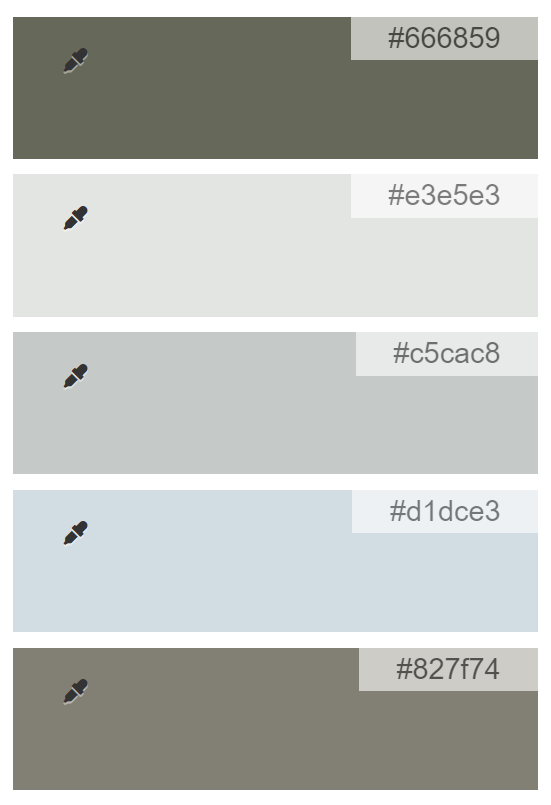
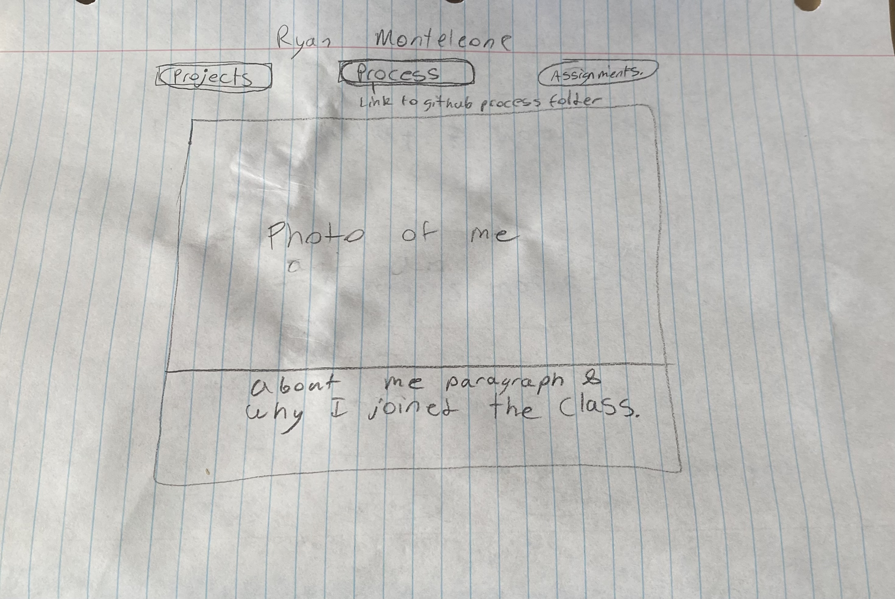
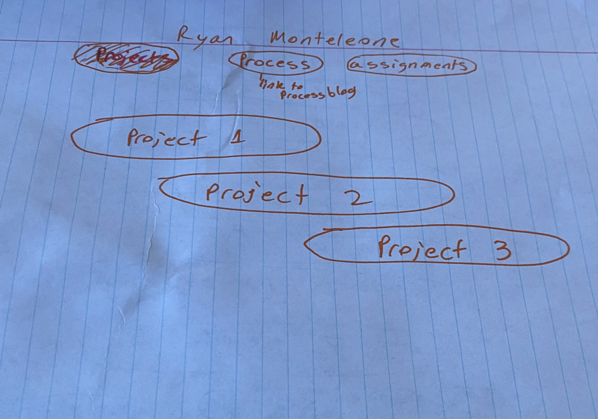
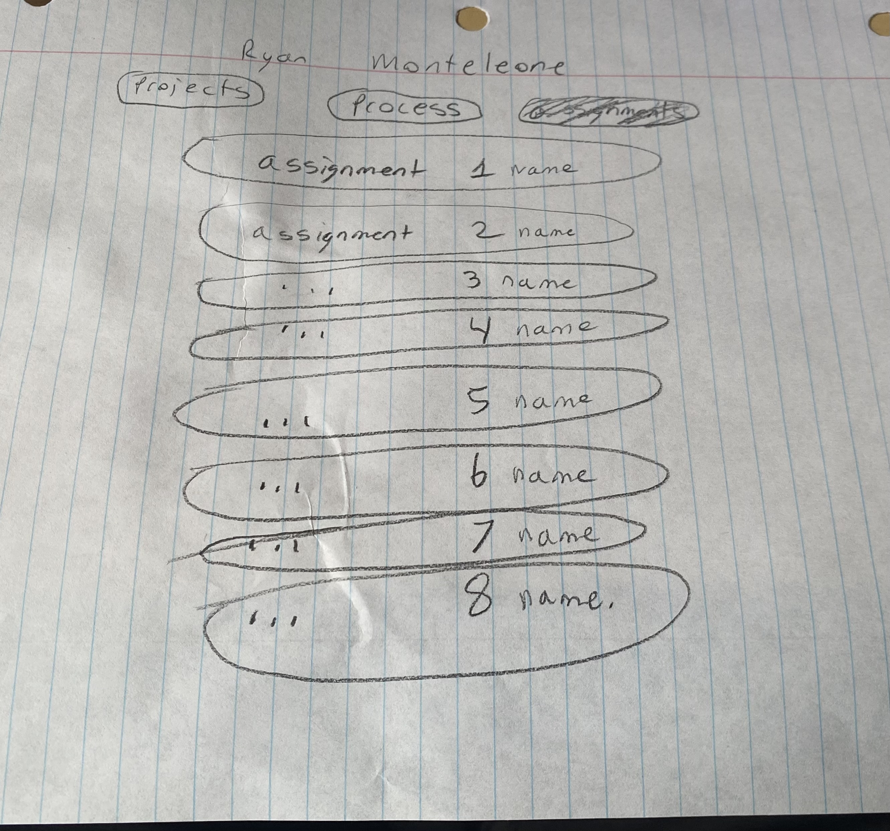

# Class Portal, Process
## Milestone 1

The overall them my portal will have is an outdoor theme. This theme will really allow me to put my personality and hobbis into the portal. For the main first load in page I will include some of my personaly by including a photo of me with a fish along with a quick about me paragraph. With the wide range of availability that comes from an outdoors them I will be able to keep the portal professional and simplistic. The portal will be straight to the point and have a straight forward lay out in which the user will be able to easily and efficiently navigate the menu and pages. The color scheme I have chose is based on my love for the outdoors. Shown below is the color scheme I will utilize.

I began by creating a visual mock up wireframe in the form of a sketch in order to get the layout down visualy. I realized I wanted to keep this page inviting so I will make the boxes very rounded to give them a better look and less sharp and harsh.

The main page shown below would be to first page loaded and welcome the user with a photo of who I am along with a brief about me and why I joined the class.

The projects page will list the three projects I will be completing in this class. These will take the user directly to the main page of those projects when they click the desired project. I am keeping everything fairly narrow in my wireframes and will adjust accordingly giving max and min widths to adjust and increase the responsiveness of the page.

The Assignments page will follow the same format and capabilities as the projects page. Since we will be completing more assignments than projects these clickable links will have less hieght since there are more of them. I also plan to put in some sneak peak thumbnails for each project to keep the page interesting and show the user a preview of the project. This design also gives me room to add a description to each project or assignment.

In regard to responsiveness I plan to make use of the CSS media queries in order to change the page layout dynamically depending on the size of the window or the target device. I also will be first developing a design for mobile first as recommended in lecture to ensure that would be responsive as it is easier to adjust to having to much room rather than to little. Also as shown in the wire fram above I made the layout very narrow as with that when the screen gets narrow you can scroll to still see the content without the formating going crazy. I also plan to make the inividual assignment and project tabs dynamically sized so they are not super small on the larger monitors but will first design them to be small so they are working for mobile device viewers.