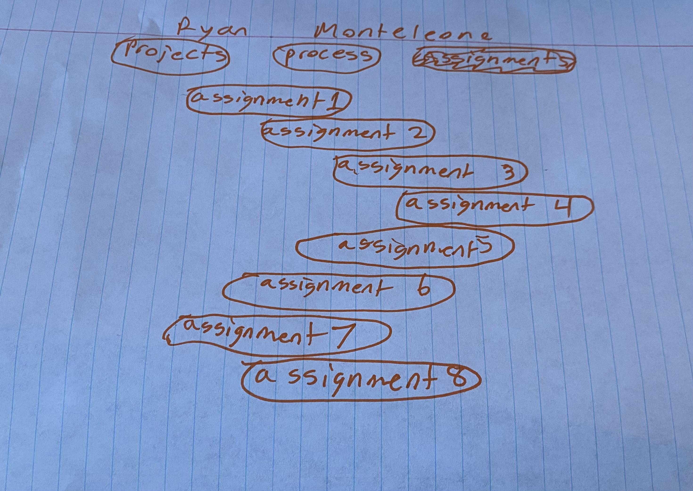

# Class Portal, Process
## Milestone 1

The overall them my portal will have is an outdoor theme. This theme will really allow me to put my personality and hobbis into the portal. For the main first load in page I will include some of my personaly by including a photo of me with a fish along with a quick about me paragraph. With the wide range of availability that comes from an outdoors them I will be able to keep the portal professional and simplistic. The portal will be straight to the point and have a straight forward lay out in which the user will be able to easily and efficiently navigate the menu and pages. I will be testing my skills by adding hover effects for every clickable link. I am also going to attempt and create a more interactive feel when each page loads up by having the content come in from the sides or top rather then just being preloaded. The color scheme I have chose is based on my love for the outdoors. Shown below is the color scheme I will utilize.

I began by creating a visual mock up wireframe in the form of a sketch in order to get the layout down visualy. I realized I wanted to keep this page inviting so I will make the boxes very rounded to give them a better look and less sharp and harsh.

The main page shown below would be to first page loaded and welcome the user with a photo of who I am along with a brief about me and why I joined the class.

The projects page will list the three projects I will be completing in this class. These will take the user directly to the main page of those projects when they click the desired project. I am keeping everything fairly narrow in my wireframes and will adjust accordingly giving max and min widths to adjust and increase the responsiveness of the page. I also plan to stagger these out but only slightly so they still fit well on smaller screens. I will also experiment with making them not staggered and in a line if the width becomes to narrow for the stagger.

The Assignments page will follow the same format and capabilities as the projects page. Since we will be completing more assignments than projects these clickable links will have less hieght since there are more of them. I also plan to put in some sneak peak thumbnails for each project to keep the page interesting and show the user a preview of the project. This design also gives me room to add a description to each project or assignment.

In regard to responsiveness I plan to make use of the CSS media queries in order to change the page layout dynamically depending on the size of the window or the target device. I also will be first developing a design for mobile first as recommended in lecture to ensure that would be responsive as it is easier to adjust to having to much room rather than to little. Also as shown in the wire fram above I made the layout very narrow as with that when the screen gets narrow you can scroll to still see the content without the formating going crazy. I also plan to make the inividual assignment and project tabs dynamically sized so they are not super small on the larger monitors but will first design them to be small so they are working for mobile device viewers.

## Milestone 2
[Class Portal Link!](https://class-portal-frontend-web-development-monteryan61.vercel.app)

I began working on my portal in a small window sized for mobile. While doing this and begining to implment the staggered menu I found this was difficult and near impossible to line up. After a while of messing around I figured out that with flex boxes it was very easy to center align the tas. It proved to be very difficult to achieve this stagger and remain dynamically sizeable. I bailed on this idea and may come back to this design if time allowed and I had the remainder of the design completed. While designing the main page I decided to not only have a link to my process blog but a seperate link to my code within github. I did this so that user wouldn't have to go to the process blog then navigate to the code. 

On the main landing page I experimented with the border-radius attribute on the buttons. I found this very cool how unique you could make the once rectangles look.

When making the window smaller the butons change size based on the size of content within them. I found this to still be dynamic and unique as the ordering went from the longest word being assignments down to the smallest being code. I chose to leave this even though it would have been easy to make them all the same size box as it gave uniqueness. 

While adding a photo of me I set he same class for the flex item as my menu buttons on the image. Although this was an accident I really like the way it looked and decided to keep that styling on the image as it keeps the flow of the page looking nice.

Once I had the main page set up I began to experiment with animations for the buttons. I didn't want to make it to flashy. While doing some research on hover animations I found alot of crazy ones. I saw a few using this transition wiht an ease-out and have to color change (https://blog.hubspot.com/website/css-hover-animation). I decided to try that out and liked how suttle but effect it was and stuck with it for all of my pages to keep unison. Also for these links I will implement target=”_blank” so that a new seperate tab is opened as I found it annoying that git hub would open and they only way to reach the page again was to hit the back button.

While developing the projects page I decided to add some photos that will be replaced with a picture of each project just to give the user a litle more info on where that link will take them when they click it. Once I complete the projects I will add an informational paragraph beneath the photo and title of the project.

To keep the flow of the over all site, I made the page that will store the assignments/labs very similar so that it is a flowing UI between the two pages that are only seperated by scope of the work being a month long project or a week long assignment.

With the site up and running I went through and made sure it was sizing well for different windows. I also clicked to ensure the menu was navigating correctly. I realized there was no hover effect on the projects so I added that in to keep the flow that all clickables would change color when hovered over. I also found that once away from the main home page with the photo of me and the description there was no way to get back to that. This was fixed by making my name in the header clickable in case the user wanted to return to that main home page. Since I don't expect this to be needed very often I didn't wanna draw to much attention to the header being clickable. I made it so that when my name is hovered over it will ease in a background color similar to the other links signifying that it is clickable while not drawing to much attention to it. Shown below is on the project or assignment page the hover effect on the return to main menu by clicking the name. I then didn't think that was to intuitive still so I added a second header named class portal and made that clickable to return back to the main page. That makes more since for mobile users who won't have the hover effect.

I then wanted to add some different affects when the page loads in through css to make the page have some more spark to it. From Web I remember using @keyframes to achieve different ways for a page to load. I chose to take this route to give my page some life while still not using javascript. I experimented with this for quite some time and found alot of the animations were overwhelming. I decided to just have the header drop down to keep it simple and not to distracting of an animation.

As some overall clean up when developing the site I had three different style sheets one for each of the html pages. When I attempted to condense this down I ran into a problem. When I was on the project or assignment page I wanted that to become a darker color to indicate that the user was indeed on that page. Without having a seperate style sheet for each of these pages I was unable to achieve this without the use of JS. So I decided to keep the seperate style sheets for now. That was until I found out you can have one main style sheet applied then can add an additional one to make a small change like the one I was needing. So I made the change and condensed the style sheets down to one main one that all pages are initially loaded in with. Then had one for the projects and one for the assignments that would make the one change in the header to make the background darker signifying where the user is in the site and to make my name clickable.

Overall the site came out looking great. The color pallet really sticks to three colors which makes me think of glaciers and winter time which is my favorite season. The shapes I chose for the buttons are very unique but not distracting from the site content which I love.

[Check it Out Here!](https://class-portal-frontend-web-development-monteryan61.vercel.app)