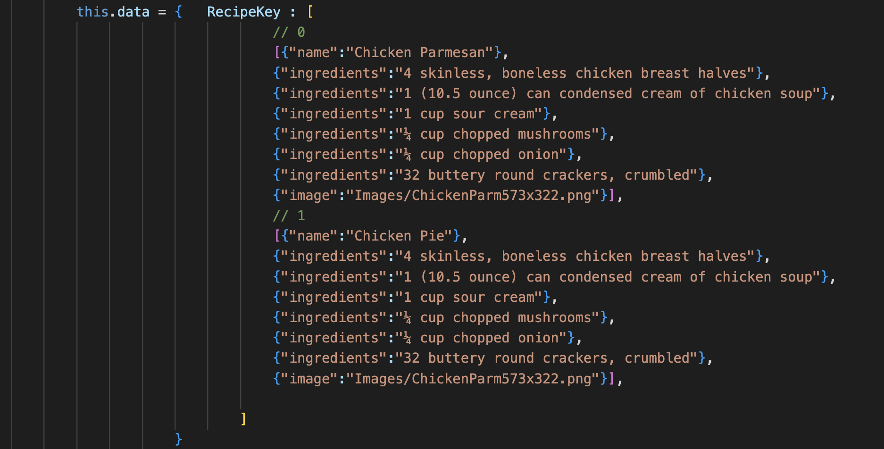

# Final Project, Process
## Milestone 1 Proposal

### Overall description of the project:

* The topic/purpose of the SPA
    * Cook Book Application
* Your inspiration for the SPA
    * As a college student I never know what to cook and get tired of searching random ad filled websites
    * I love food and am interested in making new things
    * This will be a great way to explore and learn React and the SPA element that comes with that
* The intended audience for your SPA
    * College Students interested in cooking different items.

### Wireframe that shows the design and flow of your team's project. This could be anywhere from hand drawn sequence of images to a low-fidelity mockup in a UX design tool of choice.
We utilized https://coolors.co to figure out a food based cook book vibe type of color pallete to begin. Since this is a group project we both wanted to be on the same page and thus made a prototype within figma rather than a paper sketch. 

### Sources
Hover Effect on images: https://github.com/ciar4n/imagehover.css

I am sure we will find more along the way. We will definetly be using the React websites documentation.

### Personal Contributions
Plan to work and focus on the hover affect to begin. Then I really wanna get this involved with apis and possibly some back end to store some reveiws.

### Goals
* Prototyping/proof of concept
  * Prototyped out in figma to ensure we are both on the same page as far as the content we want on the site.
  * Selecting a appropriate color palate 
  * Researched some api's and hover affects
* MVP (Minimum Viable Product)
  * At Least 10 recipes to choose from and search from.
  * Hover effect on these as images in a gallery so that we are able to have the user hover and then see more. Then they would click to view the entire recipe.
  * Finding the recipes and displaying them in a unique fashion
* Stretch goals
  * Utilize an API to get access to even more recipes and have them rotate out and have recipe of the day
  * Utilize a database to store the user's review of a recipe they have tried.
  * Creating a search bar
  * New day, new recipe with the date displayed at the top right like a recipe of the day

## Milestone 2 WIP
Overall after beginning this project it has become apparent how much more planning and preparation is needed when creating a React based SPA. I have been able to come up with and implement certain components up to this point. I have mainly focused on what will be static such as the title and the search bar. Getting the search bar to work in react took some adjusting from when it was in normal js. I will be adjusting the first idea to get this search bar implemented in a way that allows us to highlight or bring attenttion to one of the recipes. Even though that was a stretch goal to begin with I find that the site needs this as a MVP so that will be implemented.

I have begun to add just a list of recipes but also began to look into an api to populate this list. Most seem to have to be paid for so that may be out of the plan and just create a list with our top 10 favorite recipes.

Shown above is what I have experimented with thus far and will work on the styling, animation, state for the full recipe and image inclusion. But for now I am getting content loaded in and decided what needs to be state and what needs to be a seperate component. We are finding that it is hard to develop with multiple people as there are so many different ways of implementing and utilizing components. We will work to solve this by getting a good plan set in class! After further collaboration we have our components planned out and found an api that may work but for now we will continue to use static recipes to get the flow down and see if we have a way to implement the api late. I found a cool way of storing the data that could be adapted into using an api! Now with all of that on the way I plan to work on getting a hover effect to work in react using event listeners.

## Milestone 3
Thus far we have the base set... This is where it gets interesting. I have been thinking of many ways to make the page change when a title is cooked so that it can then get rid of the other titles and show show the one clicked as a larger image and all of its ingredients and steps to make. One thought was that everything is still seperately loaded by the main container. While this would work and I had it nearly working by passing from the cooking titles component which is a child of the main container. I passed from the child to the parent but then I needed which title was clicked to be accessible in the ingredients component so that I could then access the correct recipes ingredients from the large data set of the recipes ingredients. I am now working to instead call in the ingredients from the cooking titles component and just pass the info to the chiled component being the recipes which will then populate the correct ingredients to cut out the middle man of the main component. The problem I have run into with this is getting the components that were loaded in from the main container to be hidden when a title is clicked and the ingredients are pressed. I would presume that I will need to pass from the cooking titles to the main container that same toggle being used so that main container can hide the search bar and cooking titles component. 

I was able to pass the toggle state of the cooking titles back up to the parent container to then hide the other components. Now I will be able to use that in the main component to call in ingredients as it would load in from the cooking titles component now because that is hidden. This is will work perfectly and gets me back on line I may need to also pass the current title's id to be viewed up as well but that is no big deal. Then I can pass that id to the ingredients and it will be read from there to pull in the correct photo and ingredients. I feel like at this point the states and class structure of react has clicked! Took a while but I am feeling better about it now. It is definetly a large learning curve hiding and showing states rather than just making a new html page.

I have chosen to keep all of the recipes data in a map and access them in a way that no matter how recipes are included in that data set the page will still be loaded regardless of if there is one recipe or 1,000 recipes. At this point it is not looking like we will reach the API recipe pull in we had hoped but with this set up it would be simple to add and just would need a function to populate that map using the api and the rest of the code would remain unchanged.

With this I ran into another problem I now had which button was clicked and had that info in a string variable in the component with the data but when attempting to access the data through this.data.ChickenPieIngredients.map without hardcoding it like that it couldn't access the correct map since I had a string of the name and not actually a name that correlated to the area in memory where that data existed. I got around and improved this by getting just correlating the id from which they are in the cooking titles with which index the ingredients and putting them into one large list. There are better ways of doing this I am sure but for now this works great. I like the class seperation that there is now with the titles holding the titles and a seperate class holding ingredients that just seems to make the most sense instead of one class they are broken up into much smaller managable components.

After I had the state all set the ingredients page had to stray bullet points. This was due to the way I was looping through the list and for the name and image in my data set those weren't able to load in so they were blank and thus showed empty bullet points. I was able to resolve this by adding a if statement to ensure nothing would be displayed if there was no data returned (undefined) for data.ingredients when traversing the list and creating the bullet points of the recipe.

I now need to add a back button so that I can get off of the ingredients page for that specific item. This will be similar to the way I used a button to call back up to the main container but now it will be setting that value to true to load in the search bar and the cooking title components again. That was simply implemented currently the functionality for the MVP is there now need to work on adding some yummy recipes and the styling of the website. The search bar will also need to be implemented but this is most likely gonna be dependant on if we need one with only 10-20 recipes I do not think a search bar will really help. I may still implement just as fun learning process. Could just have the page scroll down to it somehow that would be cool. Also am planning to implement the hover effect to show the title but the idea of having a side box with ingredients pop up on a hover is out as that doesn't seem attainable or that useful to the website.

We then got the hover effect to work through some css but it still needed some styling and fixes. One issue is when the title is there while hoving you are unable to click to view the rest of the recipes. So we are going to work to finish.

With the buttons utilized to change the toggle I have been experimenting with the bootstrap css library. This has become very useful and a nice skill to add into my tool box. I changed the bulleted list ingredients into a bootstraped styled list to make the over all flow of the page look much better.

Now with the hover effect I am running into the problem of this title inside the button not being centered as it is a different size width and hieght the the button so it only shows up if you hover in the spot the h2 exists in the page. I attempted to fix this through padding which works but then it is a guessing game so now I am trying to find a way to set the padding to be the same size as the button so that it always shows up on hover of the button and is center but is still dynamic for all screen sizes. This will most likely require some js to implement this. So I will attempt that an just us a style tag on the title for simplistic sake.

Through addind a hover state and a some onMouseEnter and onMouseExit checks in the button I was able to resolve this problem of it only showing up when over the small h2 tag. Then I just need to center that in the button. 

But when I first did this it had all of the titles for every recipe appear so I added a id state so that I knew which one was being hovered and could add a check to only load in the h1 if the id match in the list and the state for which was currently being hovered.

I think this would be way cooler with the api working so rather than focusing on the styling of the page currently I would like to get tha api working and populating the data sets. I now have the api pulling through recipes for a specific search I know need to find out how to populate this in an array to then have it appear with the ingredients and photo. So based on the users search for a category I will populate the home page and the ingredients page with however many exist in that api's data base for the option they chose. For example there are 10 results when pizza is search for so that will be populated on the home page when searched. I have quickly found that altering the state of an array is very difficult.

As seen above I am just populating the information in the array that I had previously staticly populated with the information from the api. So non of the actual base code will be changed just making the data populate from the api based on a search. This array will then be passed to cooking titles and ingredients to replace their static arrays. Passing the arrays caused some trouble with just getting objects so I have decided to just collect the data where it will be used and just pass what is being searched for.

This was challenging as I still needed to send the request just once when the search value changes so I do this by on check if the prop changes everytime the compoenent updates and if it does then we search for the new recipes. Although I think I found why this was not working when passing as a parameter I needed to access a specific object which is very simple so I think I will go back to that way as I am runnning into a lot of timing issues this way.
Now it is apparent that the order of events is off it is sending the undefined list before the api is able to return its data. This is very difficult to figure out creating a new list and passing that around I have been working on it for 3 hours and am still running into problems. It works fine with the static array declaration but I need this to be dynamic. I may have to bail on the nested list format of this because I cannot find out how to access [Object, object].
I am going to restructure the way the data is being stored due to this issue. into just a bunch of seperate arrays to prevent this object problem. 
WELP I found the mistake and it was pretty silly. I was trying to use a weird way to append an array of objects `` build = [...build, [{"name":`${data.hits[i].recipe.label}`, "img":`${data.hits[i].recipe.image}`, "id": `${i}`}]]``
but I needed to be building that object up and then just using `build.push(newObject)` after making this change I was able to pass it around and access all of the objects  just fine. Classic 3 hours right there just a part of the process ;). 

But no somehow it still isn't working when attempting to put it into the state of the main component so I think I am just going to stick with several seperate lists and rethink some of the logic in the rest of my code.

I got it to work by passing the array of objects to the main component and then seperating it into list there without utilizing the state. Now the search will bring up 10 recipes based on the api for the top hits of those recipes. Now I will work on the ingredients component to be adapted to work with the api.

This api has ingredients but no steps so I included the link to the actual website it is sourced from so the user can get all of the details. With this I was able to create a pass the same list gained from the search into the ingredients component and use the index of whichever button was clicked to load in the correct recipe ingredients and name. Although I wish this would have worked for the list of objects I gave it my best shot and the functionality is still the exact same. I am sure it is something to do with that the object is passed by reference or something weird with not bein able to update the state of an array of objectss and I just am not sure why I am not able to access that still but after hours of trying I find it ok to pivot for this project.

When attempting to parse the list of ingredients by a "," that messed up some thing as sometimes that wasn't the end of the ingredient I fixed this by before it got converted to a string somehow I added a * so I could parse by that and that worked perfectly. I went through a lot of parsing and string manipulation to ensure the ingredients came out perfect.

This project has come a long way at this point and has been through many iterations. I have learned alot about react and api's up to this point. I could continue to add other facts such as calories but I think for now this site is fully functional and actually very useful. Through using minimal resourse I am not sure all of this is the best way to do it but it is my way of doing it which I have truly learned alot from struggling through figuring out the concepts on my own.

Now just for fun I am making some additions. For example when you search for something then click a recipe then go back it doesn't show what is currently being shown. I added a variable called currently showing so that when you press back you know what you last search for.

I also wanted to protect the edge case of a user searching something that is not in the api's categories. I did this by before calling cooking titles we ensure that the recipe names and images are defined.

I implemented a check list feature for the ingredients so that a user can kind of guage how many they have before deciding if they want to click the source and cook that recipe. 