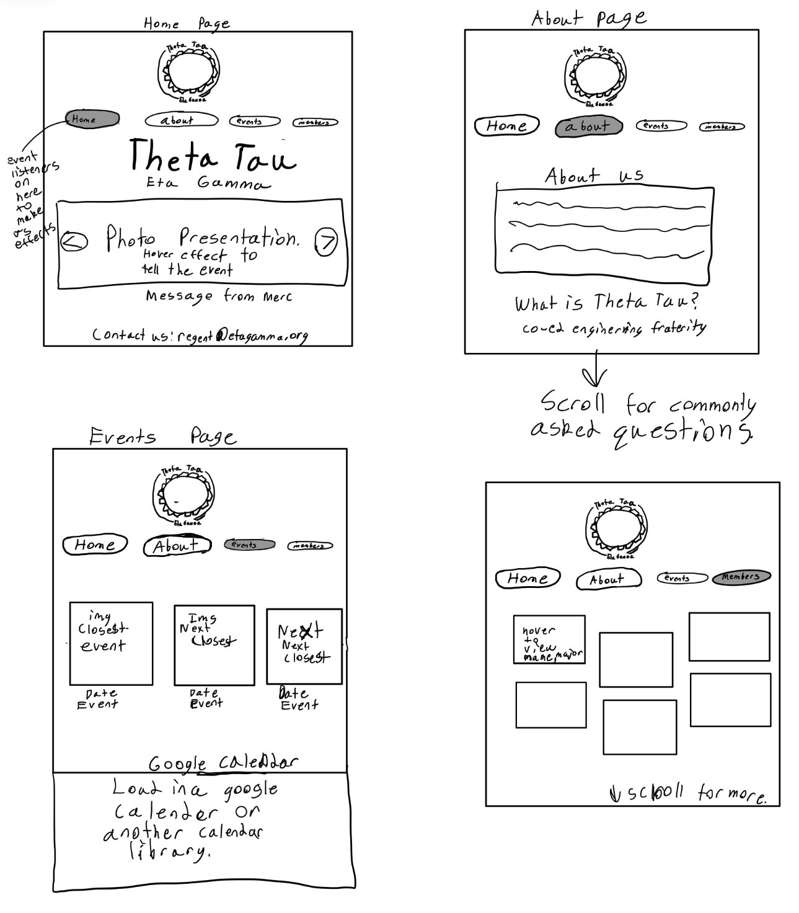
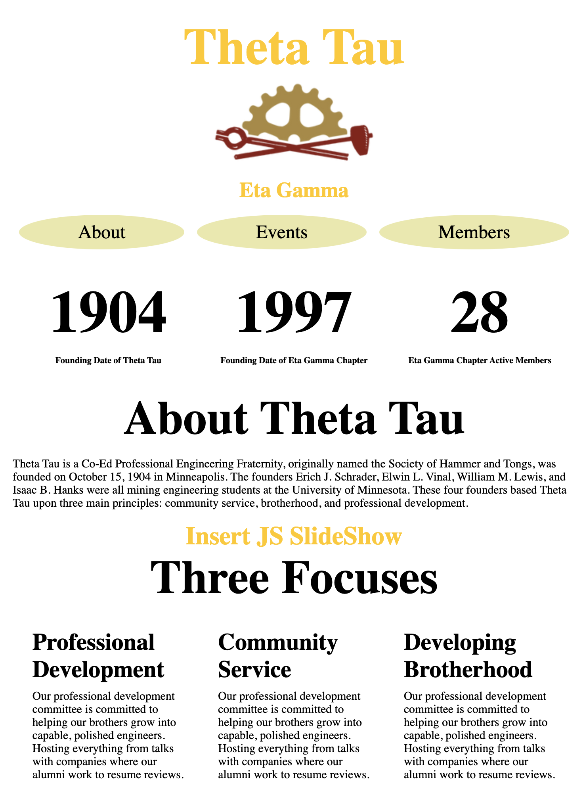
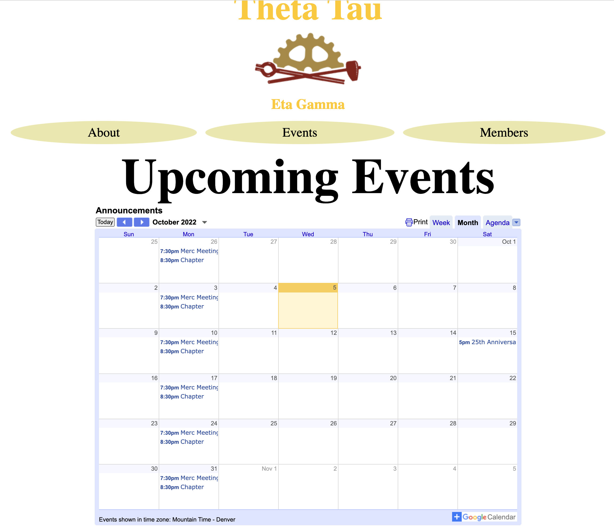
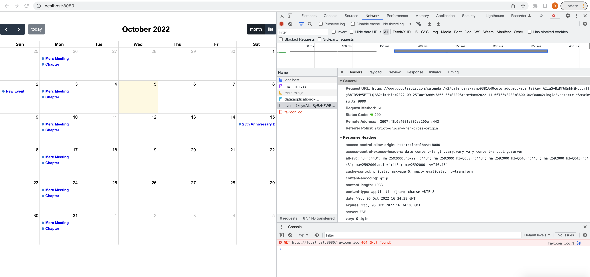
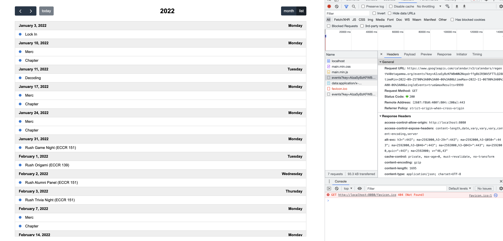
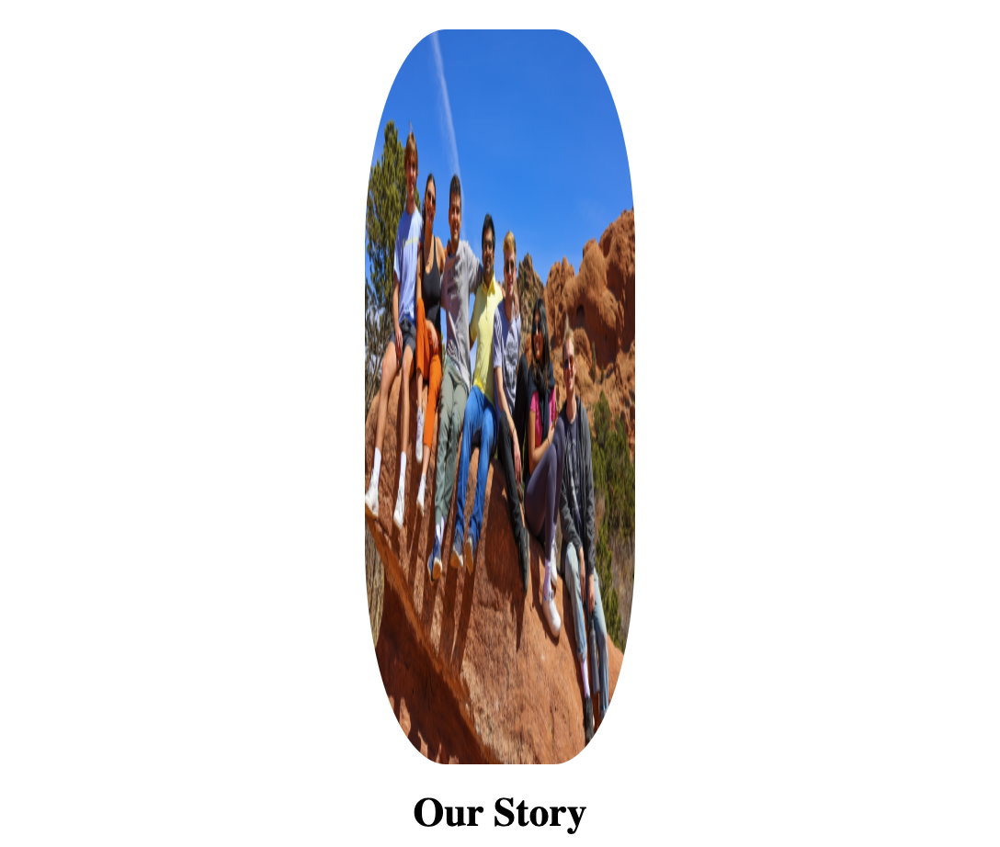
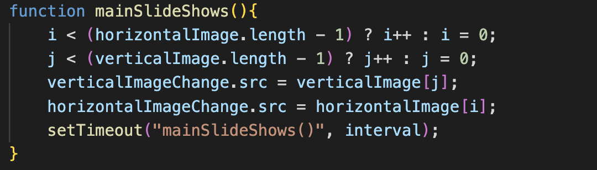

# Project 1, Process
## Milestone 1 Proposal

I am the current president of Theta Tau a co-ed professional engineering fraternity on campus. During out chapters we have been talking about updating our pre-existing website that was created many years back using square space. But with this project I would like to completely create a new website for our chapter in order to help spread the word and share information about what we do. The topic of my website will be surroundning the Theta Tau Fraternity, our previous events, upcoming events and contact information. My inspiration for this is to utilize and engineering skill as we are an engineering fraternity I have never liked the fact that our website was created from square space. This is something I am very passionate about and want to make very intriguing to help members have a site to look back on some cool events and get excited about future events. The intended audience for this project is the members and anyone within the engineering school.

## Wireframe

## Use of Javascript
Since this site will be mainly to show off photos, upcoming events and some history. I plan to use javascript to show that as a professional engineering fraternity we are able to apply that in many different ways including our official website. I also plan to utilize javascript to enchance page transitions through a library called transition.js. This will go past the level that CSS is able to with some over the top visuals. I also plan to utilize the google charts to show some of the stats we have on both a national and chapter level as far as members, alumni, and alumni connections across the world. I want to pursue this as it will help me in the future since visualizing data is a great tool to have and google products are supported within many company projects. One specific feature I plan to include is that when you hover over an image it will tell you what event that picture is from. This will provide more meaning behind each image. Those may be very ambitious goals to learn the charts and libraries. I will fall back on a simpler slide show implemented in js.

To achieve this I plan to utilize https://developers.google.com/chart/interactive/docs to learn more about google charts and how to implement that in my website. http://www.transitionjs.org will support my use in creating interesting transitions. I will also draw some ideas from other chapters websites to know what content must be on there. https://www.thetatauumd.com & https://www.thetataugw.org.

## Dynamic Sizing
Similar to my class project I plan to develop on a mobile size screen as if it fits well there it will be easy to adjust for the larger screen. I will also use flex boxes to keep the material in a good state when shrinking and enlarging the window size. I will put a max-width in a percentage on images to prevent them from becoming to large on bigger monitors. 

## Goals
My goals for prototyping and proof of concept are to fully flesh out every page within a wireframe and keep this simple but usable. I plan to create a little of every page when in the prototyping state to keep from getting to far down the line on one page and losing a cohesive design between each page. I feel when developing a few pages bit by bit they flow better then completing one and moving to the next. 

My MVP is to have many photos and a few charts that show members and those interested in the organization what we are and what we do.

Stretch Goals are to fully have a website that is able to have the ability to secure more interaction between the user than just reading the page and seeing amazing charts, information and photos. Another stretch goal is to use a library to create a calendar on the events page such as FullCalendar https://fullcalendar.io. Another stretch goal will be to add more than just the four pages add one for rush information and pledge information.

## Milestone 2 
I began by getting the bare bones layout of my site layed out. I started with the home page and noticed that this page would be able to function both as the home page and the about me page so I eliminated the need for these two seperate pages. I am focusing on using flex boxes in the page layouts to keep them dynamically sized. I am also changing the layout and adding some information as needed I am doing content in a full row followed by 3 columns that explain further in 3 sections the information that needs to be displayed. Since I am first getting this layout down I am adding in to-do's to keep space and signify where some of the more js heavy content will be placed. I am planning to use a similar layout as my portal for now with the menu but this may change depending on time. I do like how it could turn into a sort of signature aspect to my web design though!

With this base layout I decided to move into actually implementing the slide collage of some cool activities, we partake in!
I then began to experiment with a js photo gallery library called Galleria. This is a free opensource library that allows a slideshow like affect. While trying to install this library it was not going smoothly and I began to look at other options. It had the dependencies of grunt-postcss and jquery and I was unable to get those downloaded correctly. Then I found that you cna include a google hosted jQuery so I gave that a shot.

While working on the barebones of the events page I began researching libraries that could help me create a calendar. I then was looking at our chapters events and found an embeded code and was simple able to add this calendar which we already have all of our events into the html. This takes the javascript out of it and allowed me to achieve a stretch goal in a simpler fashion. The calendar at first was very bland and ugly. I did some research and found that there is a better way to import the calendar using js and the fullcalendar.io I talked about earlier. This would allow me to learn more js and enhance the calendar and page through js knowledge so I went this route.
https://fullcalendar.io/docs/google-calendar This was no easy task it required me to create a new calendar api then import the fullcalendar.io. This was a great learning experience as to how APIs & Services work. 

This was not easy and took a lot of experimenting  figuring out the google calendar api, setting up the calendar to be shared correctly through this api and altering the tutorial code to match my needs and allow my information to come accross. Using this is much more appealing and satisfying. I was able to expand on my js knowledge and get a very cool js library implemented that shows all content from our already updated google calendar. This makes the website very dynamic as the changes will be reflected without having to make any changes to the code just the google calendar which we already update. This calendar also has a list option which is very useful for mobile viewing and saves the usability of the calendar in a mobile view! Figuring this out was my main progress for this milestone as it was very time consuming to learn the ins and outs of the api and the js library involved.

 I did this in a seperate file system to begin with so I had no outside variables. Now it is time to make this addition to my site. 

 ## MileStone 3
 Then I began to work on the slideshow for the main page. The point of this slide show is to loop through display different photos contained in an array of different events and cool things we have done as a chapter to make the page less text heavy. I also decided that I want to add a small caption to give some context of what event each photo was from. I began by making an array with a few photos and a function that would get the id of the img tag I created in the html. That function is then called on the first load of the page to kick off the slide show. It then is set to at the end of the function be called again based on a time interval that can be set for how long each image is displayed. I began with 3 seconds and left it there. I then added small captions in an array to then be added to a p tag right beneath its respective photo being displayed. This function is very nice because if I want to add a nother slide show on this page or any other one I can easily just create another array of images and array of text to be altered in the same function at the same time. I did run into a problem with this though. I have been using flex boxes to keep everything dynamic and working for small screens, but when the images were in a flex box they became distorted.
 
 I attempted to use object-fit: contain; but that ended up making the images way to small. I was then able to alter the size of the flex box to fix this. Although there is a transition in shape between portrait and landscape photos I think this is the best way to keep the photos from distorting. As no matter what if I attempt to have landscape and portrait in the same slide show there will be distortion if there isn't this set up. I may explore having a slide show on this page for landscape photos and a seperate one for portait photos I think that would be good to explore. Since then on mobile using object-fit:contain; was way to small I am going to create a seperate slide for portait and seperate for landscape. This worked great as I worked on the landscape slideshow but since the images were slightly different heights the page would shift the text down or up slightly which made it very hard to read. I fixed this by adding a height to the flex box that the slide show was in to prevent this shifting. I think to make this look better on a small screen I will need to use window.innerWidth; to change the height of this flex box depending on the size of the screen. I made this change by getting the window size in js then altering the height base on that!
 I will come back to work on the portrait slide show soon.

 But for now I want to get the members page rolling. This page will be very straight forward and focus on the members and their majors. To make this easier to update I will use arrays in javascript to populate the photos of members along with their description mainly just their major. This use of arrays in JS will make it easier to update so that no html is needed to be added. 

 I then went back and created the portrait slide show. This was quite easy since I already had a function set up for the landscape slide show I was able to reuse portions of that. I first just created another function to do the portrait slide show but then I had a lot of duplicate code. I then found a way to create one function that takes care of both slideshows and stuck with that, as it reduces the amount of code used. I then found that I did not need a class for my landscape slideshow as I only had one so I made this change to keep my code well in line with standard practices. After condensing down to one function it had four very line consuming if else statements simply reseting the index or incrementing it. This was taking up way to many lines so I decided to turn the simple if else statements into conditional (ternary) operators to make the function a little more condensed and readable. . I then thought it would be cool to add some animation to this slide show and I began experimenting with altering the style through the DOM to call an animation, document.getElementById('test').style.animation = 'fading 2s infinite'.https://stackoverflow.com/questions/53389833/js-changing-source-image-with-animation found here shows that the setTimeout function is not exact so the timing for this was very hard to get write so I decided to divert from this idea for now and make it a stretch goal.

I was not satisfied with the slide shows yet at this point. While showing off the slides to some members they often requested I go back to a picture. Since this was just a loop that displayed a new image every five seconds or so we would have to sit there and wait. That is when I decided to make and additional function in which if a button to the right of the slideshow was pressed it would go to the next image and if a button to the left was pressed it would go back an image. This worked great and I was still able to keep the loop timing through. A stretch goal I would like to add is a better way to reset the timer when a button is pressed so it displays for the full 5 seconds and not just the remainder of the time.

Looking back at my milestone 1 I remembered I wanted to use the library transition.js. I experimented with this library for some time and struggled to get it loaded in and want to come back to it after we learn more about libraries. But for now I was able to implement the effects I wanted to within css so there was no loss there. I also found no real need for charts as that information would change a lot and be hard to keep update. I find that the use of the google calendar library where it updates based off information we always keep updated online was a much better use of my time and better for the life of the code. I chose photos that will still get the point across so even if not updated frequently they will still be ok and the calendar should remain updated through the API.

 ## After Critique
During the presentation feedback I was reminded of the difficulty it is to have others update a website that was not created by them. I received a very usefull slack comment to look and see if there is away to populate the slideshow photos from google drive rather than having to put them into the repo. This will really help to easily update this website for future members. Also I will to go back and do some code review and cleanup. Then some younger members to teach them and share the repo in order to ensure they have the simple knowledge needed to update the members page. Other than that I was happy with the presentation.
